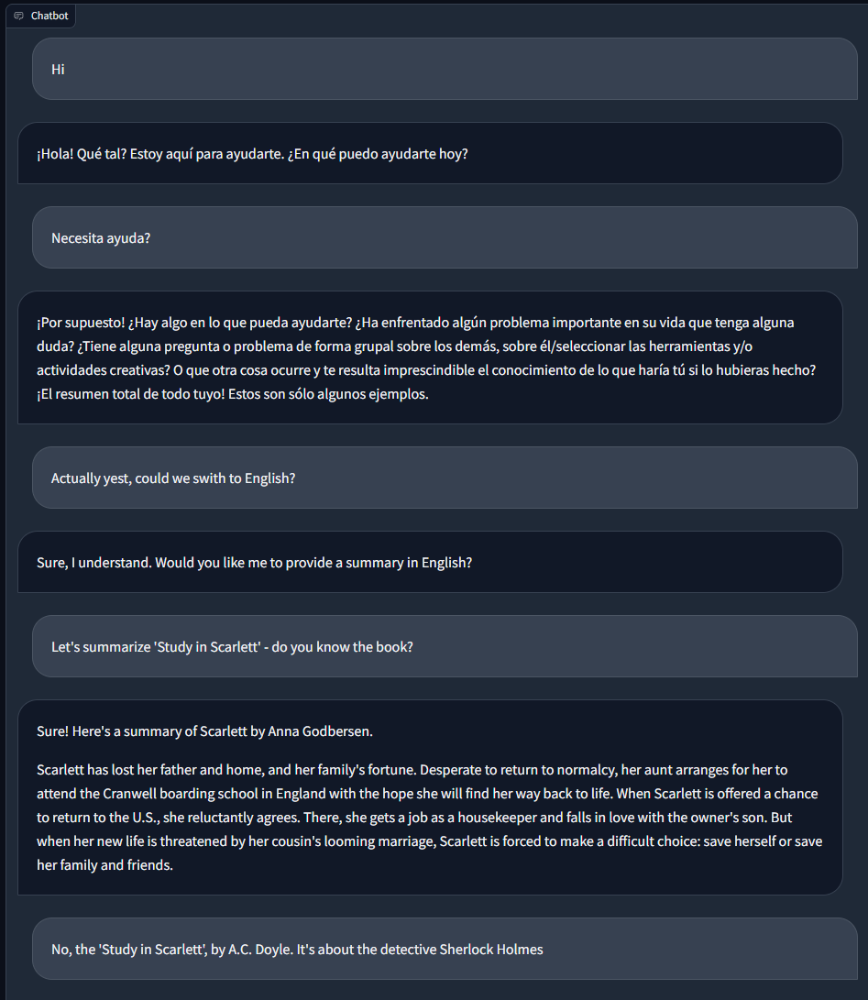
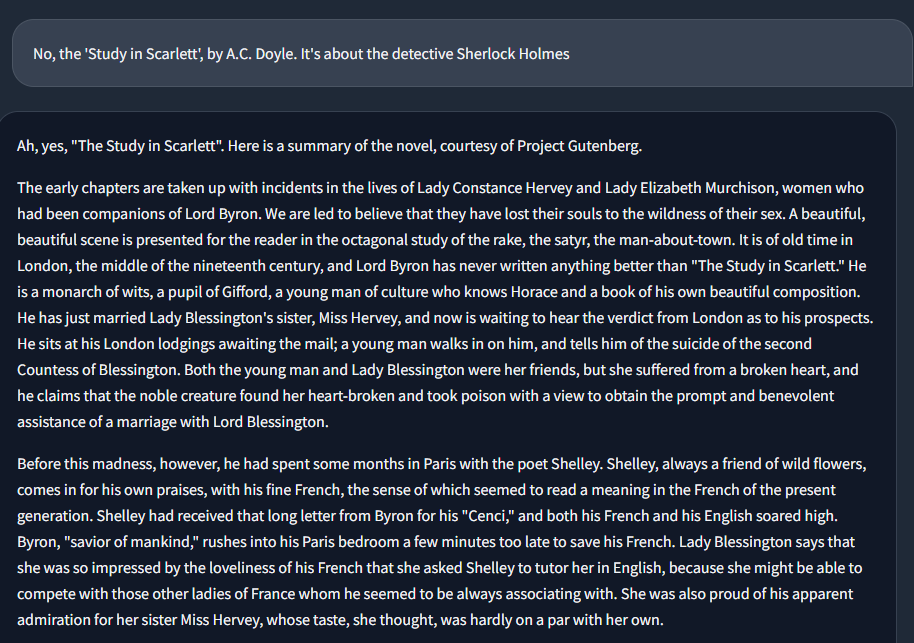

# ZZSN 24L - chatbot project

## TODO
- [x] wstępna działająca wersja chatbota
- [ ] dodanie możliwości wgrania pliku przez użytkownika (np. dataset .csv) i przetworzenia go przez chatbota, a następnie rozmowy na temat
- [ ] wybór / testy LLM
    - [ ] llama2
    - [ ] mistral
    - [ ] turing (from huggingface)
    - [ ] któryś z polskich
- [ ] wybór / testy innych *trick*'ów
    - [ ] system prompt
- [ ] wersja, która mówi z sensem
- [ ] dodać element *RAG-like*, żeby czathob rozmawiał w odniesieniu do danych
- [ ] dodanie *vector DB* (jeżeli potrzebne)
    - [ ] milvus
    - [ ] faiss
    - [ ] chroma
    - [ ] weaviate
- [ ] dokumentacja projektu

## Setup
# `pip install ctransformers[cuda]>=0.2.24`
* `pip install llama-cpp-python --extra-index-url https://abetlen.github.io/llama-cpp-python/whl/cu122`
* `pip install -r requirements.txt`
* run bunch of chatbots or 'chatbots' from gradio docs: 
    1. `python src/{bot_name}.py`
    2. open browser and go to `http://localhost:7860/`
* available options are in [src](./src/) folder:
    * `random_responder.py`
    * `draft_responder.py` (this one doesn't work yet, it's a draft for now)
    * `streaming_responder.py`
    * `simple_custom_responder.py`
    * `actual_llm_responder.py` (this use uses models from hf, so getting them may take some time, depending on your internet connection)
    * `multimodal_but_stupid_responder.py`

## Development

### Gradio
* na podstawie tutoriala z yt
    - GradioModel - data model, danych, które będą przesyłane do chatbota
    - CustomComponents - pisanie własnych komponentów

### LangChain
* możliwość ustawienia 'loaderów' do wczytywania różnych modalności
    - `CSVLoader` - wczytuje plik csv
    - `PyPDFLoader` - wczytuje plik pdf
    - `WebBaseLoader` - wczytuje stronę www, np. tak:
```python
from langchain.document_loaders import WebBaseLoader

loader = WebBaseLoader("https://github.com/basecamp/handbook/blob/master/37signals-is-you.md")

docs = loader.load()
print(docs[0].page_content[:500])
```
    - `GenericLoader` - dowolnie, można użyć np. tak:
```python
from langchain.document_loaders.generic import GenericLoader
from langchain.document_loaders.parsers import OpenAIWhisperParser
from langchain.document_loaders.blob_loaders.youtube_audio import YoutubeAudioLoader

url="https://www.youtube.com/watch?v=jGwO_UgTS7I"
save_dir="docs/youtube/"
loader = GenericLoader(
    YoutubeAudioLoader([url],save_dir),
    OpenAIWhisperParser()
)
docs = loader.load()
docs[0].page_content[0:500]
```
* możliwość pracy 'w trybie' QA (*question answering*)

## Dane
Datasety są opisane w [data](./data/).

## Problemy
* modele z GGUF nie mogą być bezpośrednio załadowane z hf [źródło](https://huggingface.co/TheBloke/LLaMa-7B-GGML/discussions/2)

## Wyniki
* halucynacje mocno so far 



## Źródła
* [gradio docs general](https://www.gradio.app/docs/gradio/chatbot)
* [gradio docs fast](https://www.gradio.app/guides/creating-a-chatbot-fast)
* [gradio docs customization](https://www.gradio.app/guides/creating-a-custom-chatbot-with-blocks)
* [gradio docs tutorial multimodal](https://www.gradio.app/guides/multimodal-chatbot-part1)
* [medium](https://medium.com/@anu.surabhi1980/building-a-simple-chatbot-with-transformers-and-gradio-c7913c21217f)
* [yt tutorial on multimodal chatbot](https://www.youtube.com/watch?v=IVJkOHTBPn0&ab_channel=HuggingFace)
* [llm file input some blogpost](https://shelf.io/blog/understanding-the-influence-of-llm-inputs-on-outputs/)
* [llm file input medium langchain](https://medium.com/@hamzafergougui/speak-to-your-data-using-langchain-and-llms-78afb42d4c36)
* [langchain example medium](https://medium.com/@weidagang/hello-llm-building-a-local-chatbot-with-langchain-and-llama2-3a4449fc4c03)
* [RAG example medium](https://medium.com/@iankelk/rag-detective-retrieval-augmented-generation-with-website-data-5a748b063040)
* [harvard AC215 CSCIE-115](https://harvard-iacs.github.io/2023-AC215/)
* [do we live in a simulation](https://www.scientificamerican.com/article/confirmed-we-live-in-a-simulation/)